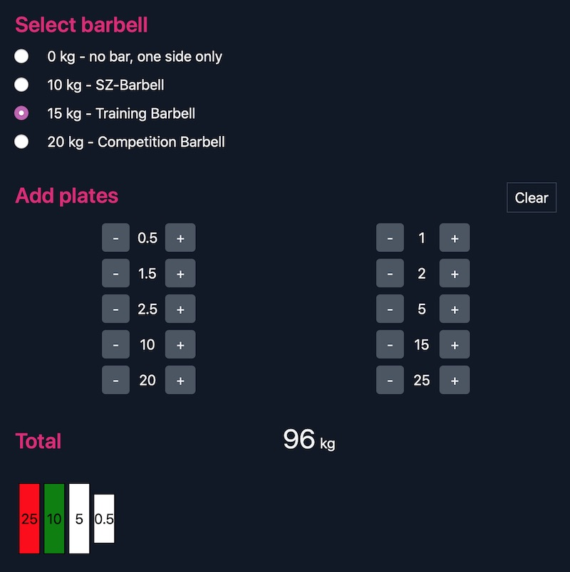

# Plate calculator

A simple plate calculator that calculates in kg, and gives you your total depending on selected barbell and added weight plates.



# Config

If you want to adjust barbells and plates that are available to you, edit the followong array in index.html, with bg_color being a [CSS color string](https://www.w3schools.com/cssref/css_colors.asp) or HEX color code, and height being the displayed plate height in rem.

```
availableBars: [
    {label: '0 kg - no bar, one side only', value: 0},
    {label: '10 kg - SZ-Barbell', value: 10},
    {label: '15 kg - Training Barbell', value: 15},
    {label: '20 kg - Competition Barbell', value: 20},
    ],
availablePlates: [
    {value:0.5,  bg_color:'white', height:'14'},
    {value:1,  bg_color:'green', height:'14'},
    {value:1.5,  bg_color:'yellow', height:'14'},
    {value:2,  bg_color:'blue', height:'14'},
    {value:2.5,  bg_color:'red', height:'14'},
    {value:5,  bg_color:'white', height:'20'},
    {value:10,  bg_color:'green', height:'20'},
    {value:15,  bg_color:'yellow', height:'20'},
    {value:20,  bg_color:'blue', height:'20'},
    {value:25,  bg_color:'red', height:'20'},
]
```
